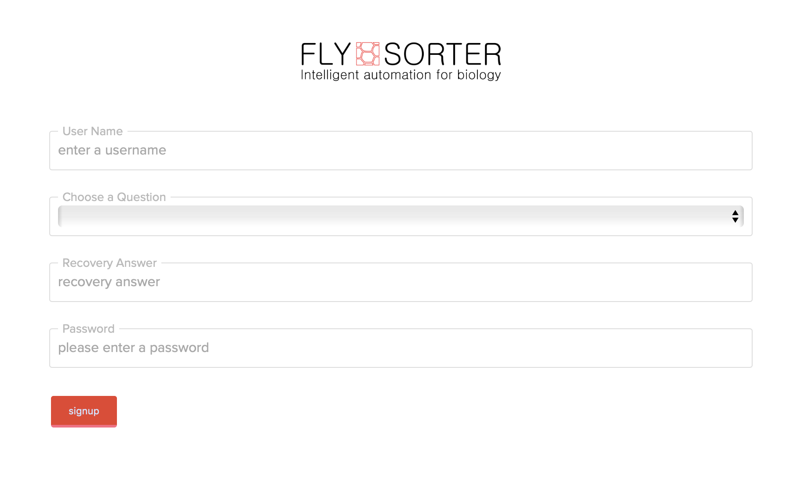
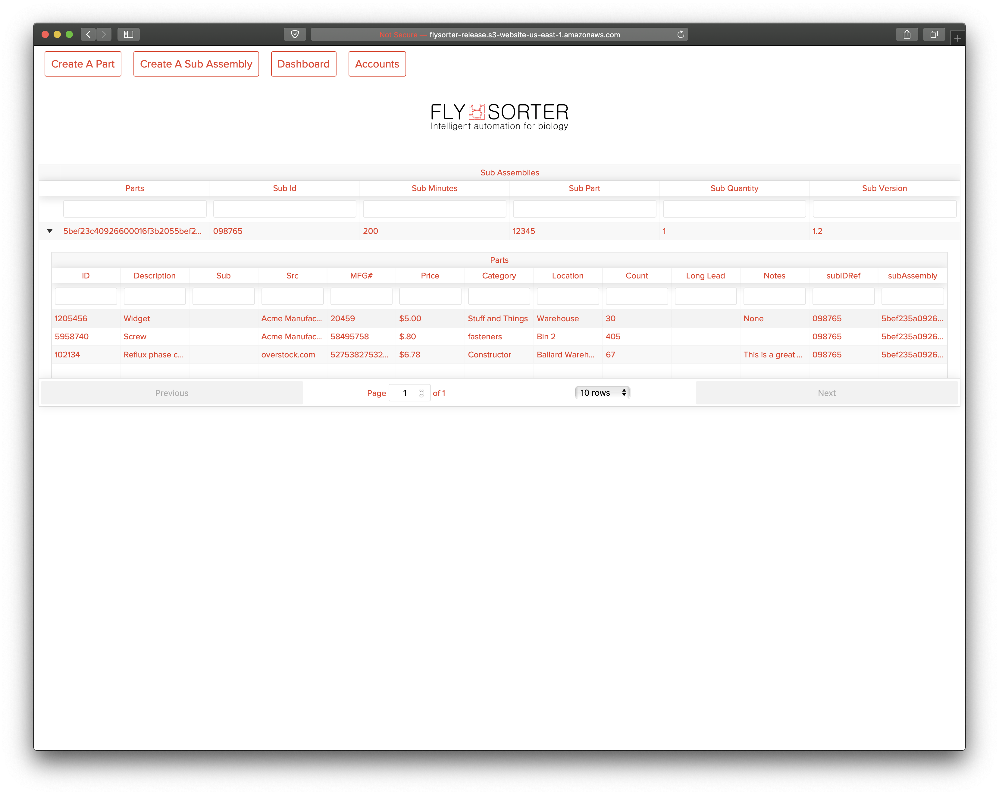
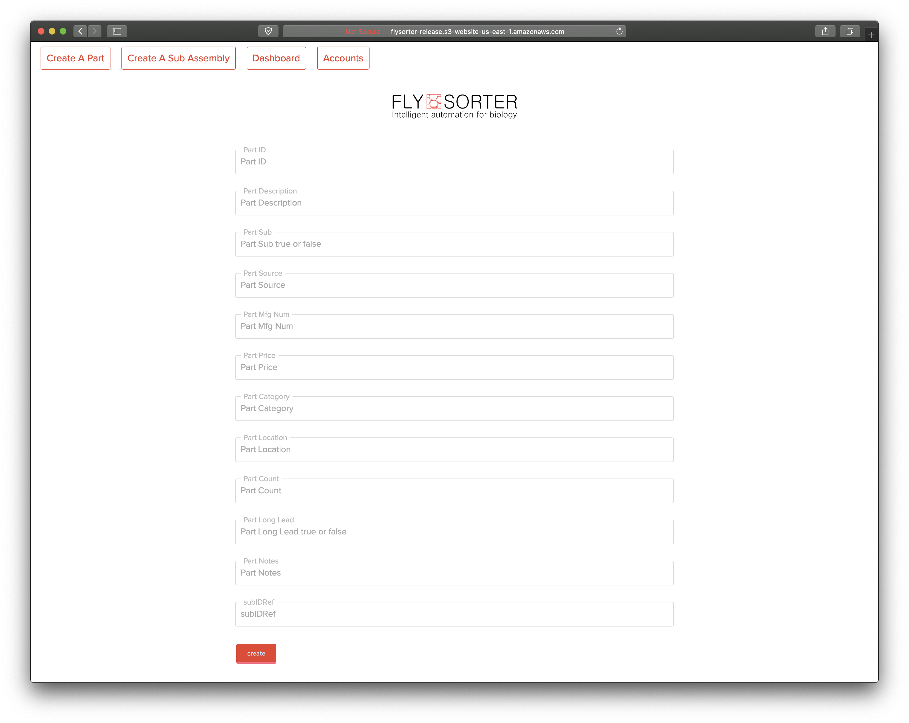
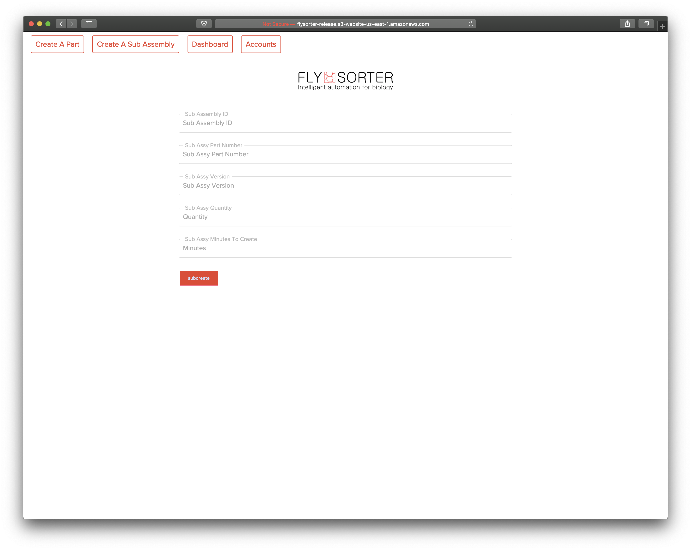

# ***Front End Repository***
- If you're looking for the back end repository, click [HERE](https://github.com/fncreative/FlySorter-back-end)
# Build Status
# Description
- An inventory management application for the Seattle-based company Fly-Sorter. Fly Sorter builds
machines to sort fruit flies so they can be used for scientific research. This application keeps track of those machine assemblies, sub-assemblies, and the parts that belong to those
sub assemblies. These components are displayed on the page and allows the user to click
on a sub-assembly to reveal the parts that makeup that sub-assembly.
The table also allows the user to filter parts and search for a part in order to make finding particular parts faster and easier for the user.

# Languages, Technologies, Frameworks, & Libraries Used (frontend)

1. React
2. Redux
3. React-Table
4. WebPack
5. Babel
6. Eslint
7. SCSS
8. Match-Sorter

# Running the application

- To run the application locally, follow all of the steps in the backend repository and then additionally follow the steps below:
1. Start the frontend environment by executing the ```npm run watch``` command in your terminal.
  - If done correctly, a new browser window will open with the application, and the following message should appear in your terminal: 
     
        ```info: Server is on at PORT: <portNumber>```
        
-  Next, you will create an account on the front end but clicking the link in the lower left hand corner of the site.
- Choose a username, recovery question, and password.



-  Once your account is created, you will taken to the dashboard, which is the main page of the application.



- Once you are on the dashboard you will see not only the table(s) with the sub-assemblies, but you will also be able to create new parts and sub-assemblies by clicking the appropriate links. 
- When you are creating a sub assembly, take note of the very bottom field. This is the sub-assembly ID, and you will use that number to add parts to that sub-assembly on the part creation page.



- To add a part, you can click the link in the top left of the screen. This will take you to the part creation page. Remember the ID of the sub-assembly you created? Great! Did you forget it? That's OK, it displays on the dashboard as well.
- To link your new part to your newly created sub-assembly, enter it in the first field on the part creation page.
- That's it! There is no step three.



___
***Authors: [Benjamin West](https://github.com/bgwest) | | [Daniel Frey](https://github.com/fncreative) | | [Tom North](https://github.com/tnorth93) | | [Wyatt Pefley](https://github.com/peffles)***
____

